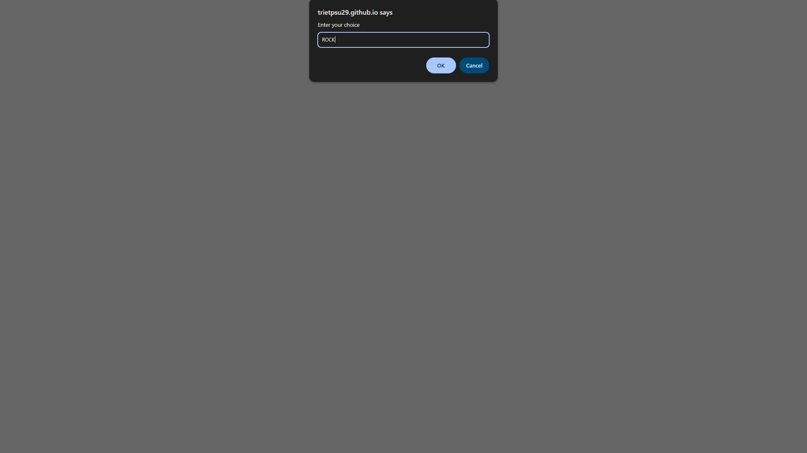

# 🎮 Rock Paper Scissors

This is the third project from [The Odin Project](https://github.com/TheOdinProject) curriculum — A simple console-based Rock Paper Scissors game built in JavaScript to practice core programming skills.

## ✨ Preview

## 🛠️ Skills Learned

### 📜 JavaScript Basics

- Variables and Operators
- Data Types and Conditionals
- JavaScript Developer Tools
- Function Basics
- Understanding Errors
